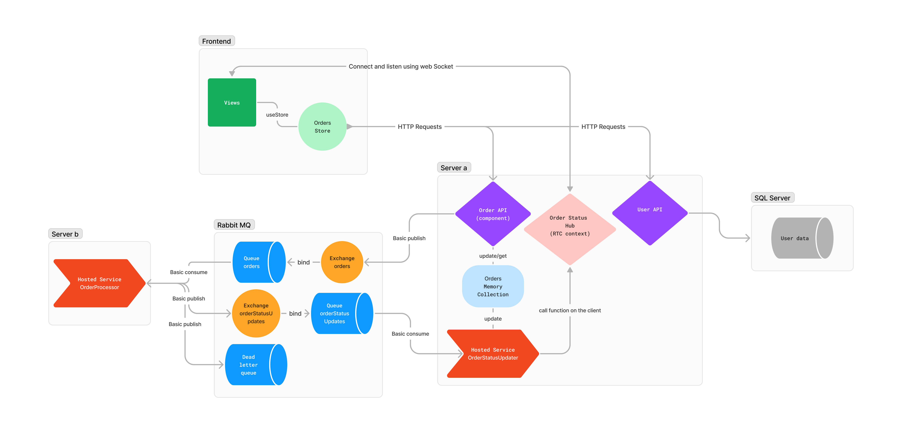

### Course information 
Author information:
- Student Name: Yousif Al-Baghdadi
- Student Number: 152106946
- Student Email: yousif.al-baghdadi@tuni.fi 

Group Information (single person group):
- Group Name: oneteam
- GitLab repo URL: https://course-gitlab.tuni.fi/compcs510-spring2024/oneteam

### Technology Stack
#### Server A
ASP.NET (Core) 8 with C#.

Using Controller Web API template.

Reasons for using the technology:
- The developer is familiar with the framework.
- Great performance, C# is one of the best performing web frameworks. 
- Out-of-the-box support for many modern web application patterns. for example:
    - Support for Logging providers.
    - Dependency Injection pattern making applications easier to maintain. 
    - Support for OpenAPI specification documentation (swagger).
    - Tooling for making setting up authentication and authorization.
- Wide selection of community developed packages (just like NPM) like Rabbit MQ drivers, database drivers and so on.
- It is worth noting that modern asp.net 8 is cross-platform, cloud native and open source framework.
- Strongly types programming language offers the ability to catch error early.

##### Other libraries
- **AspNetCore.OpenApi**: Libraries that facilitate work with open API specs.
- **Swashbuckle.AspNetCore**: ASP.NET library for swagger UI.
- **RabbitMQ.Client**: Official RabbitMQ client.
- **SignalR**: Built-in with ASP.NET, allow for easy real time communication using Websocket or other methods.

#### Server B
Dotnet 8 service worker C#.

Using service worker template. Which is like a console app but with IHost for long running service which includes tooling for DI and other services like configuration, logging, etc..

Reasons for using the technology:
- Same reasons as server A

##### Other libraries
- **RabbitMQ.Client**: Official RabbitMQ client.

#### Frontend
vue.Js with TS for the frontend. 

Reasons for using the technology::
- Light-weight and good performance.
- More flexible features with native extensions.
 
##### Other libraries
- **Vue-Router**: Multi page app.
- **Bootstrap**: css framework.
- **Pinia**: State Management.
- **SignalR**: Real-time communication with the backend.
- **axios**: Making HTTP requests.

### How to try the system
Ensure latest version of docker desktop is installed and run docker compose commands:

`docker-compose up -d`

- access the frontend on http://localhost:12346/
- access backend swagger API page on http://localhost:12345/
- access RabbitMQ management page on http://localhost:15672/#/
    - user: guest, password: guest

The apps have some basic logging which can be accessed on docker logs.

### Architecture
Here is diagram describing the overall architecture:

[Figma view link](https://www.figma.com/file/rZEwcRM8uRmPTwKIJSSEDr/sandwich-maker-diagram?type=whiteboard&node-id=0%3A1&t=X3tzOmvYt47fWMCK-1)

We go over each component in the system:
#### Server A 
Acts as the main server in our system which server the API. 

Here some things to note about this server:
- The app entry point is on program.cs
- The app is using dependency injection where the services are being registers in program.cs
- The Request pipeline is also configured in program.cs  
- The app use controller attribute routing: 
    - Controller are named API in the code
    - The routes are defined as attributes on each endpoint in the APIs
- The is hosting Swagger UI on root directory
- The app is hosting real time communication hub:
    - SignalR is being used.
    - SignalR uses WebSocket by default and may fall back to other methods if web socket not available.
    - The purpose of real time communication is to notify the frontend about order status changes.
- The app is hosting a "hosted service", things to note about dotnet hosted services:
    - Hosted services are singleton objects that are held in the app host
    - Hosted services trigger start function on the application startup 
    - Hosted services trigger stop function on application shutdown
    - Hosted services support dependency injection 
- The app is hosting `OrderStatusUpdater`, which do the following:
    - Subscribe to `orderStatusUpdates` Queue.
    - Update the state of orders
    - Publish real time update notification on the Real-time communication hub.

#### Server B
Act as order processor and emulate making sandwiches.
- The app entry point is on program.cs
- The app is using dependency injection where the services are being registers in program.cs
- The app is hosting a hosted service (more about that was mentioned on server A)
- The app is hosting `OrderProcessor` hosted service, which do the following:
    - Subscribe to orders from `orders` queue
    - Publish order received message on `orderStatusUpdates`
    - Publish order read after 5s delay on `orderStatusUpdates`

#### Rabbit MQ
RabbitMQ was used for asynchronous communication between server A and server B; The Queue system is very simple in this case as direct exchanges are used, which binds on a single queue; Therefore we can say that, Server A publish orders on `orders` queue and then server B updates server A about the order status on `orderStatusUpdates` queue.  

One important feature of the system is the dead letter queue. Server A could send message to which server B can handle; This could jam the system as server B get stuck on trying to process a bad message. To avoid that, message that have bad format are sent to dead letter queue, which then needs manual investigation from the developer.

#### Frontend
The frontend is following vue standard architecture. 

Here are some things to note:
- The app is using Pinia for state management 
- The app uses axios to make requests from the state store.
- The app is also using vue router to route to different views like Orders page.
- The app is using "bootstrap" for css
- The app has `notification` component and store, which do the following:
    - Show message to the user when successful requests are made.
    - Show red error message when request fail.
    - show loading indicator when waiting for response from the API
    - Note: best way to test this, is to shut down the main server and try to use the app 
- The app using real-time communication:
    - The app is utilizing SignalR client library.  
    - The app connection to Hub when entering Orders page.
    - The app fetches the orders again when it receives order update signal.

### Patterns used

**Health check for RabbitMQ (compose):** This ensures that RabbitMQ is running healthy before starting the other application, so that they don't crash while attempting to connect.

**Dependency Injection (DI) (server a+b):** This pattern is used by default in asp.net where services are register in a central place. DI is applying "Inversion of control" principle which is part of the S.O.L.I.D principles. The main benefit of DI is that it provide a central place in which all parts of the system are defined which is useful if we need to do integration testing with different configuration or mock services instead of the actual implementation. 

**State management Stores (frontend):** using Pinia. This pattern is very useful to ensure that component are only concerned with the actual data rather than state.

**Dead letter Queue (server b):** A queue where bad messages are sent(messages that server b can't process). This is very important for real application, because bad letter could cripple a system.

### Additional Features

- Nice and responsive frontend UI with Bootstrap
- Production grade frontend Dockerfile (with Nginx)
- Loading indicator (frontend)
- Action notifications (frontend)
- RTC communication (server a - frontend) (SignalR library was used, which uses WebSocket by default)